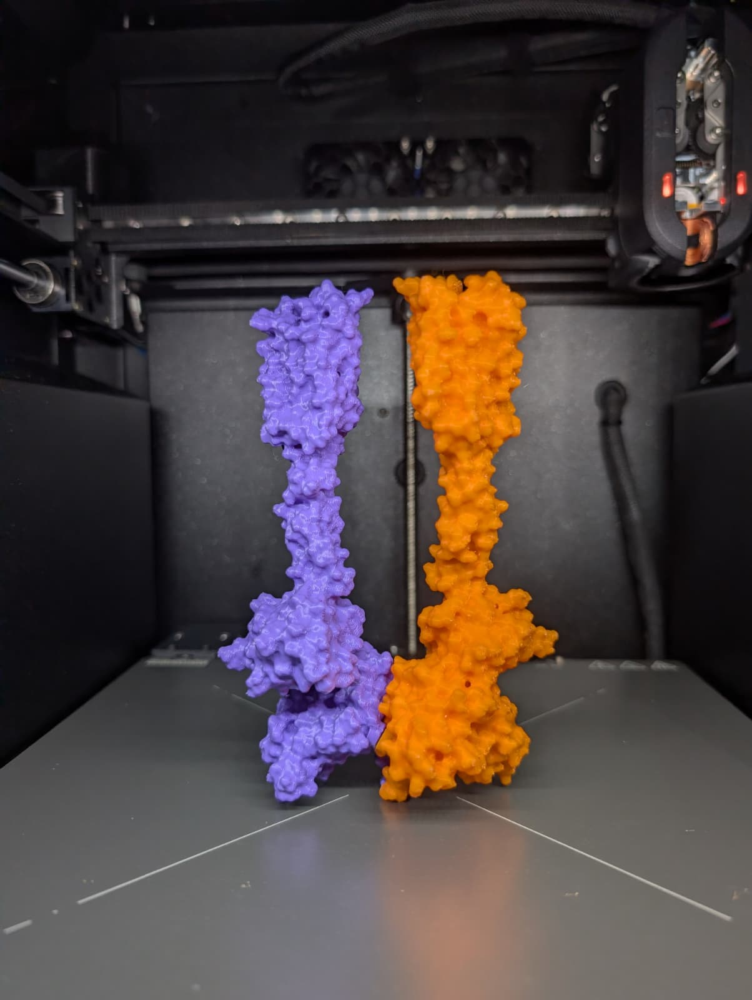

# pdb2print

Turn a PDB structure into a 3D print. Type an ID, pick a style, download a file
your slicer understands.

[](LICENSE)
[](https://doi.org/10.5281/zenodo.21599702)

### **[pdb2print.org →](https://pdb2print.org)**



*9MBB, straight out of the tool. Two chains, two filaments, two magnets.*

## What it does

You give it a PDB ID (or your own file). It splits the structure into chains,
meshes each one, and writes a **3MF with one named object per chain** — so you
can hand each chain a different filament in the slicer. You also get per-chain
STLs and a GLB for the preview.

## Why it exists

I wanted to print DNA repair complexes, and it turned out to be miserable. The
usual tools are built around proteins and treat nucleic acids as an afterthought,
so you get ribbons too thin to survive the bed and have to thicken them by hand.
Getting sensible colours out was worse.

So this does three things properly:

**Multi-colour complexes.** Every chain is its own named object in a single 3MF.
Open it, click a chain, pick a filament. Nothing to align by hand, nothing to
merge afterwards.

**DNA and RNA.** Built as solid tubes and rungs with thicknesses meant for a
printer, and the two strands of a duplex get welded together at every base pair
so the helix keeps its shape instead of flopping about as two loose spirals.

**Magnets.** Switch connections on and it works out where two chains touch, which
direction the joint can actually come apart in, and cuts a press-fit pocket into
each side. Print, push the magnets in, snap it together.

And it runs in a browser, so there's nothing to install.

## Using it

### 1. Load a structure

Type a 4-character PDB ID — `1ZAA` is a good first one — and hit Fetch. Or upload
a `.pdb`, `.cif`, `.mmcif` or `.bcif`. There are a few examples under the search
box if you just want to see it work.

### 2. Pick a style

For protein, **Surface** is a solid molecular surface. It's chunky, it's robust,
it prints without supports, and it's what you want unless you have a specific
reason otherwise. **Cartoon** gives you the helix-and-sheet ribbons from a
textbook figure, and **Tubes** gives you the backbone alone — both look great and
both are delicate, so plan on supports and ideally resin.

For DNA and RNA you get Surface or **Tube-slab**, a backbone with one rung per
base. The three chips at the top set the tube-slab look in one click:

| | |
|---|---|
| **Clean ladder** | Smooth tube, one round rod per base. The sturdiest. |
| **Molecular** | Ball-and-stick throughout. |
| **Tube + molecule bases** | Smooth tube, ball-and-stick bases. |

### 3. Set the size

**Scale (mm/Å)** is how big the thing comes out. After your first build the
estimated dimensions show up under the slider.

**Grid spacing** is mesh resolution — smaller is finer and slower. One catch
worth knowing: what actually matters is grid spacing divided by scale, so
dropping the scale coarsens the mesh even though you never touched the grid.

**Min wall** is the thinnest feature you'll allow. Anything skinnier gets grown
to it while the model is built. Surface ignores this, because a molecular surface
is already thick everywhere.

### 4. Connect the chains

Off by default. Turn on **Connect chains** and pick one:

**Fixed joint** welds the chains in plastic, either by growing them together
(Inflate) or bridging them with a rod (Bridge). Comes off the printer as one
piece.

**Magnets** cuts a pocket in each side instead, so you get separate parts that
snap together. Set the diameter and thickness to match the magnets you own.
Press-fit clearance defaults to 0.2 mm, which is right on a Prusa Core One —
raise it if the magnets won't go in, lower it if they fall out. The preview
highlights where they'll end up.

**Connect DNA base pairs** is the one that welds the two strands of a duplex.
Leave it on for DNA unless you specifically want them separate.

### 5. Download and slice

Grab the **3MF**. In PrusaSlicer:

1. Open it. Each chain shows up as its own object, named.
2. Right-click an object and use **Change extruder** to assign a filament.
3. Slice.

If you used magnets, push one into each pocket after printing, then put the
halves together.

## Running it locally

```bash
python -m venv .venv
# Windows:  .venv\Scripts\activate      Linux/Mac:  source .venv/bin/activate
pip install -r requirements.txt -r requirements-server.txt
uvicorn server:app --host 0.0.0.0 --port 7860
```

Open <http://localhost:7860>.

Or with Docker:

```bash
docker build -t pdb2print .
docker run --rm -p 7860:7860 pdb2print
```

### From Python

```python
from pdb2print import presets, export
from pdb2print.pipeline import build_all

params = presets.params_for("Clean ladder")
report = build_all("1ZAA", params)
print(report.summary())
export.write_3mf(report.built, "1zaa.3mf")
```

Every setting lives in `PrintParams` and `ConnectionParams` in
`pdb2print/config.py`.

## Things worth knowing

**Finer isn't always better.** A coarse grid smooths a thin neck shut; a fine one
can resolve it into two surfaces meeting at a single point, which isn't printable
and gets rejected. If a structure fails, try going coarser before you go finer.
This surprises everyone, including me.

**Meshes are checked before export.** Anything that isn't watertight fails with a
message rather than handing your slicer something broken.

**Install pymeshlab if you hit failures.** Without it the repair step can only
fill holes — it can't fix a non-manifold edge — so meshes get refused that would
otherwise have been fine.

**The cache** stores finished builds and serves them instantly when someone asks
for the same structure at the same settings. It fills up on its own as people use
it. If you want something warm ahead of time (a demo, a workshop), see
`scripts/cache_spec.json`.

## Deploying

`pdb2print.org` runs on a small VPS with Docker and Caddy. Everything needed is
in `deploy/`:

```bash
git clone https://github.com/davidtheadmin/pdb2print.git
cd pdb2print/deploy
mkdir -p cache && chown -R 1000:1000 cache   # the container runs as UID 1000
nano Caddyfile                               # put your own domain on line 4
docker compose up -d --build
```

Caddy fetches and renews the certificate itself, so there is no certbot step.
The first build takes 10–20 minutes — it compiles scipy, scikit-image and
pymeshlab. 8 GB of RAM is the number that matters; the surface path holds
several large arrays at once and 4 GB will fail on big structures.

To deploy an update: `git pull && docker compose up -d --build`.

## Project layout

```
server.py                 FastAPI: serves the page and /api/generate
frontend/index.html       the UI, one file, no build step
pdb2print/
  io.py                   RCSB fetch and file loading
  chains.py               chain split, protein/nucleic classification
  config.py               all settings
  presets.py              the preset chips
  cache.py                build cache
  geometry.py             dispatch to a representation
  representations/        surface, cartoon, tube_slab
  connections.py          magnets, bridges, base pairs
  export.py               3MF, STL, GLB
  pipeline.py             build_all()
tests/
```

`NOTES.md` has the design decisions and — more useful, honestly — the approaches
that got tried and thrown away.

## Built with AI

This project was written with heavy use of AI coding assistants. The
architecture, the geometry decisions and the testing were directed by me, but
most of the code was generated. I am saying so plainly because it is relevant if
you are reading, reviewing or building on it.

## Dependencies

biotite (parsing), trimesh + scikit-image + scipy (meshing), manifold3d
(booleans, required), pymeshlab (repair, recommended), lib3mf (3MF export),
fastapi + uvicorn (server).

`lib3mf` ships x86_64 wheels only at the moment, so ARM hosts won't work without
writing the 3MF export by hand.

## Roadmap

- Per-residue colouring, so one chain can run rainbow from N to C.
- A client-side port, so the geometry runs in the browser and needs no server.

## Citing

```
Häckes, D. (2026). pdb2print: 3D-printable multi-material molecular models
from PDB structures. Zenodo. https://doi.org/10.5281/zenodo.21599702
```

BibTeX:

```bibtex
@software{haeckes_pdb2print,
  author    = {Häckes, David},
  title     = {pdb2print: 3D-printable multi-material molecular models
               from PDB structures},
  year      = {2026},
  publisher = {Zenodo},
  doi       = {10.5281/zenodo.21599702},
  url       = {https://pdb2print.org}
}
```

## Acknowledgements

Structures from the [RCSB Protein Data Bank](https://www.rcsb.org/). Geometry by
[manifold3d](https://github.com/elalish/manifold), 3MF via
[lib3mf](https://github.com/3MFConsortium/lib3mf).

## License

MIT — see [LICENSE](LICENSE).
